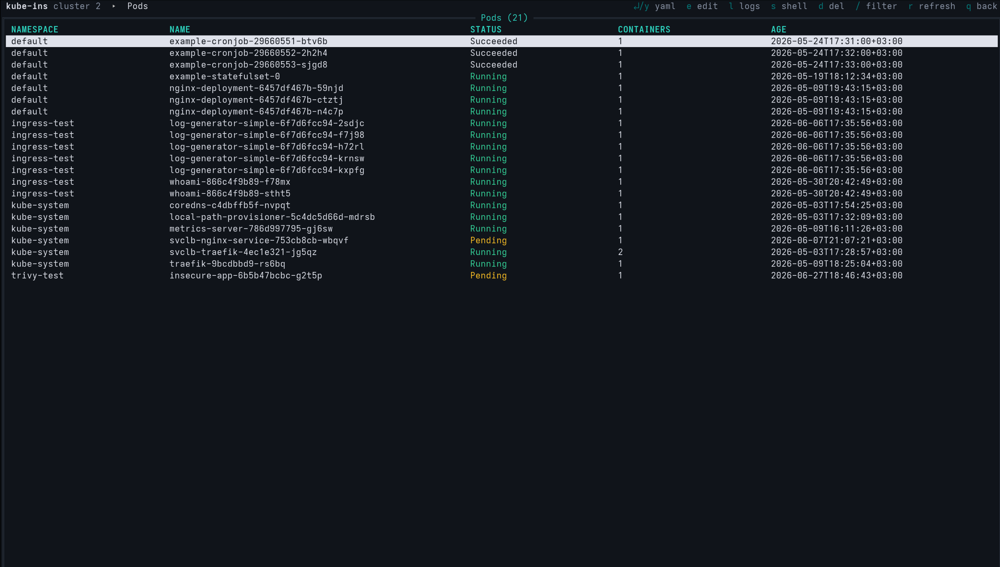

# Kube Inspector CLI

**Kube Inspector CLI** (`kube-inspector-cli`) is a terminal user interface for managing Kubernetes clusters. It brings the desktop app's workflow — a resource menu, sortable tables, YAML view/edit, deletes, live logs and pod exec — to a single, keyboard-driven terminal screen.

It is built on the **same engine** as the desktop app: every screen calls the same internal functions the GUI uses, so behaviour is identical. The difference is the front end — the CLI uses [`tview`](https://github.com/rivo/tview) instead of a browser engine, so it is a fraction of the size and runs anywhere a terminal does (including over SSH).

{ width="760" }

## Why a CLI?

- **No webview** — a single self-contained binary, ideal for servers, SSH sessions, and minimal environments where you can't (or don't want to) run a desktop GUI.
- **Fast, keyboard-first** — k9s-style single-key shortcuts for everything; no mouse required.
- **Same data, same actions** — reads the same cluster configs (`~/.kube-ins/`) and performs the same operations as the desktop app.

## What it can do

| Area | Capabilities |
|---|---|
| **Clusters** | List, add, delete and switch the active cluster |
| **Workloads** | Pods, Deployments, StatefulSets, ReplicaSets, DaemonSets, Jobs, CronJobs |
| **Networking** | Services, Ingresses, Ingress Classes, Endpoints, Network Policies |
| **Config & Secrets** | ConfigMaps, Secrets |
| **Security (RBAC)** | Service Accounts, Roles, Role Bindings |
| **Storage** | Persistent Volumes, Volume Claims, Storage Classes |
| **Cluster** | Nodes (incl. cordon / uncordon / drain), Namespaces, Events, Limit Ranges |
| **Actions** | View & edit YAML, delete resources, stream pod logs, exec into a pod |

!!! note "Single focused screen"
    Unlike the desktop app, the CLI shows **one screen at a time** — there is no split view, no dockview, and no viewing multiple clusters side by side. Each panel is replaced by the next as you navigate.

## Two ways to run it

1. **Standalone binary** — install `kube-inspector-cli` and run it directly in any terminal. See [Installation](installation.md).
2. **CLI Mode inside the desktop app** — in the desktop app, open **Open ▸ CLI Mode** to drop into a fullscreen terminal UI without leaving the window. Quitting the TUI returns you to the graphical workspace exactly where you left it.

Continue to [Installation](installation.md) or jump to [Usage & Shortcuts](usage.md).
