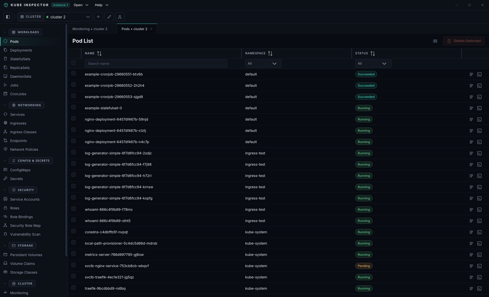
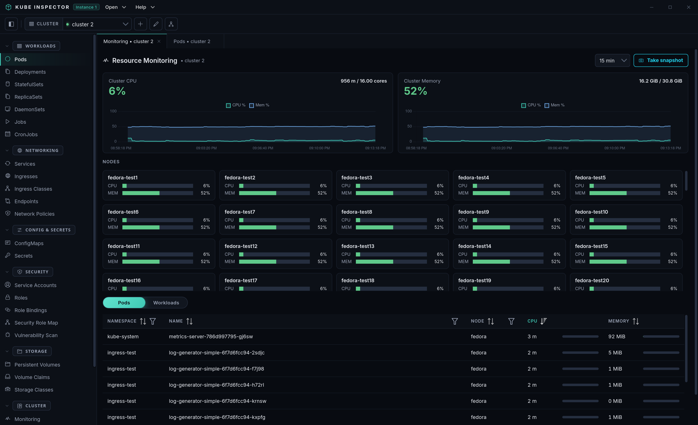
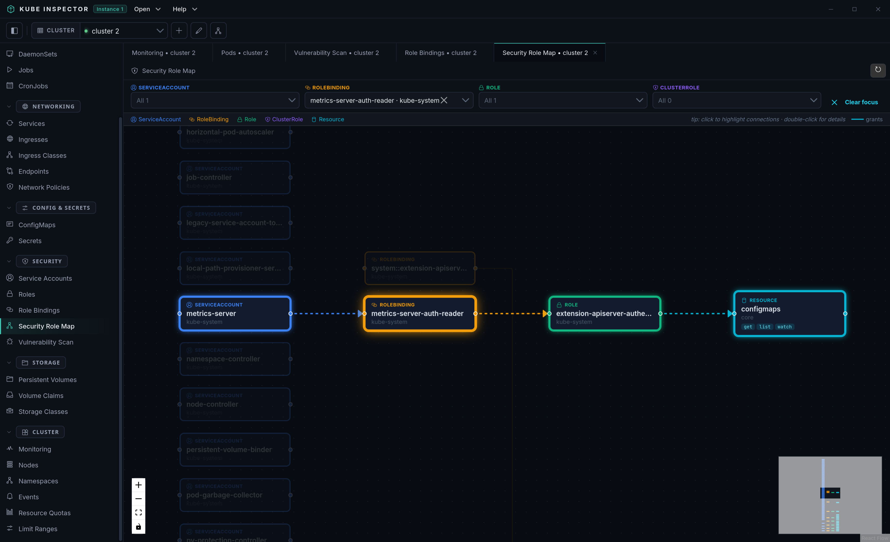
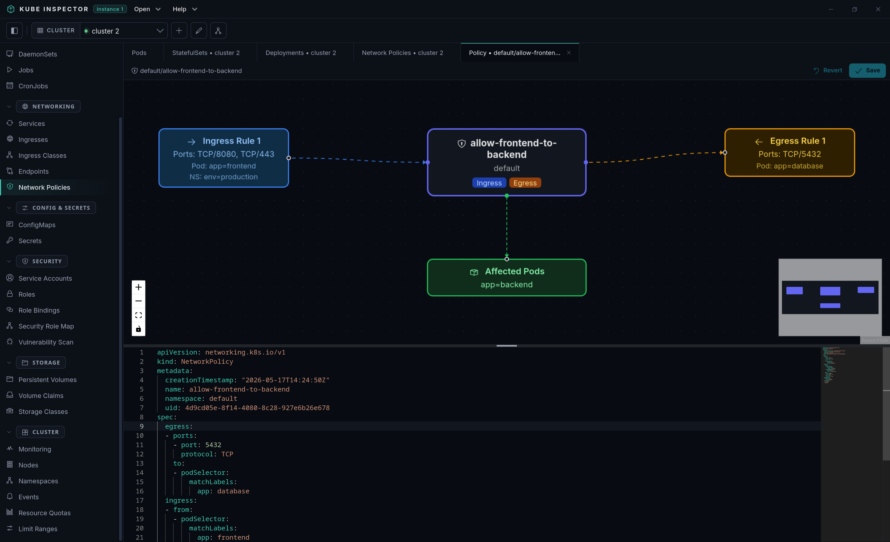
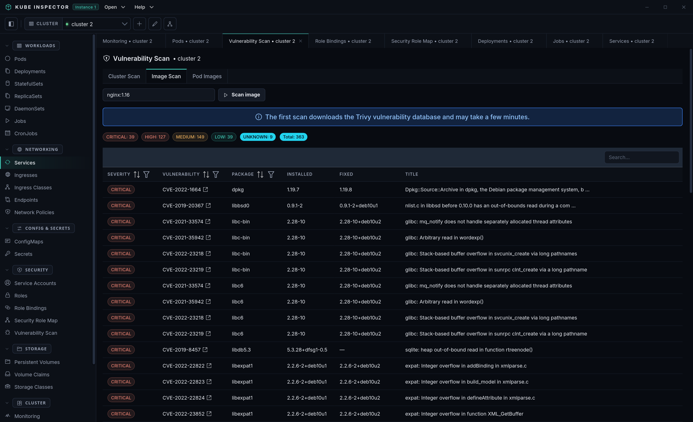
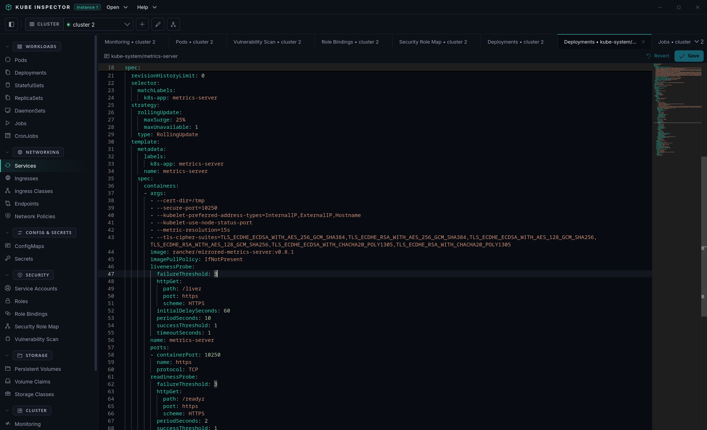
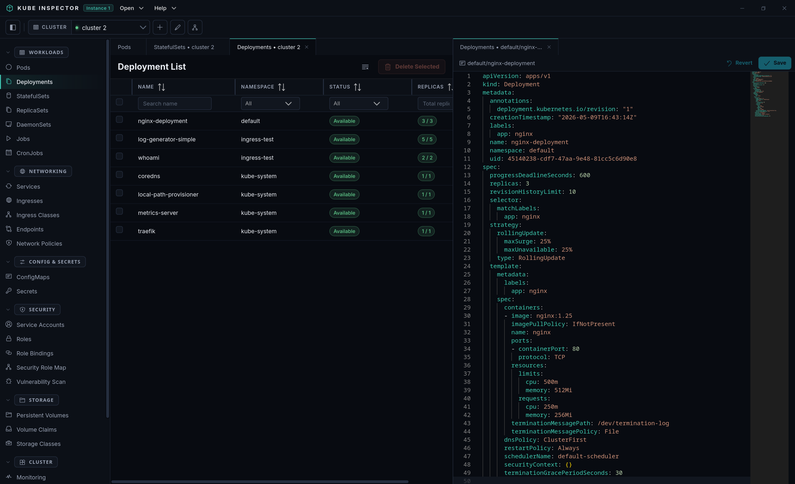
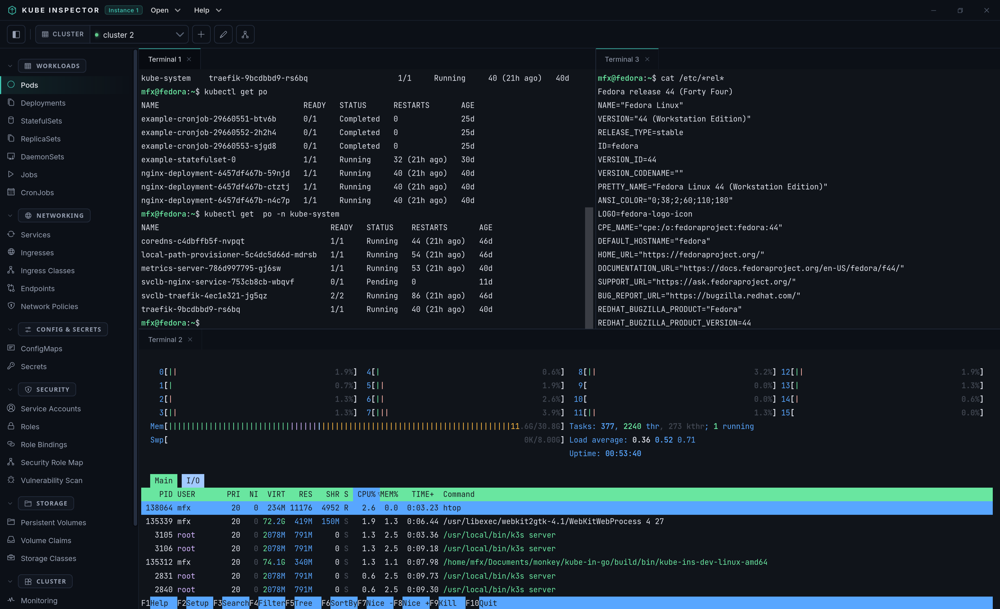

-   :material-cube-outline:{ .lg .middle } __Workloads__

    ---

    Pods, Deployments, StatefulSets, ReplicaSets, DaemonSets, Jobs and CronJobs — list, inspect, edit YAML, and delete.

    [:octicons-arrow-right-24: Manage workloads](workloads/index.md)

-   :material-server:{ .lg .middle } __Cluster__

    ---

    Namespaces, Nodes with cordon/drain, and Resource Quotas across every connected cluster.

    [:octicons-arrow-right-24: Explore the cluster](cluster/nodes.md)

-   :material-lan:{ .lg .middle } __Networking__

    ---

    Network Policies rendered as visual diagrams so you can see what talks to what.

    [:octicons-arrow-right-24: Network policies](networking/network-policies.md)

-   :material-key-variant:{ .lg .middle } __Config & Secrets__

    ---

    ConfigMaps and Secrets with a friendly key-value editor — no base64 juggling.

    [:octicons-arrow-right-24: Config & secrets](config-secrets/configmaps.md)

-   :material-code-braces:{ .lg .middle } __Workspace__

    ---

    Monaco YAML editor, an integrated kubectl terminal, and a real-time log viewer in a dockable panel layout.

    [:octicons-arrow-right-24: YAML editor](workspace/yaml-editor.md)

-   :material-layers-triple:{ .lg .middle } __Multi-cluster__

    ---

    Add and switch between multiple kubeconfigs; every tab stays pinned to the cluster it was opened with.

    [:octicons-arrow-right-24: Add a cluster](getting-started/cluster-setup.md)

## See it in action

  

    

      
      
      

        <h3>Every workload, one click away</h3>
        
Pods, Deployments, StatefulSets and more in fast, filterable tables — namespaces, live status and inline actions at a glance.

      

    

  

  

    

      
      
      

        <h3>Live resource monitoring</h3>
        
Watch cluster, node, pod and workload CPU &amp; memory over time, drill into the top consumers, and snapshot the view.

      

    

  

  

    

      
      
      

        <h3>See who can touch what</h3>
        
An interactive RBAC graph maps service accounts → roles → resources, so permissions are something you can actually read.

      

    

  

  

    

      
      
      

        <h3>Network policies, drawn out</h3>
        
Ingress and egress rules become a clear diagram — which pods are affected and what's allowed in and out — alongside the raw YAML.

      

    

  

  

    

      
      
      

        <h3>Scan images for CVEs</h3>
        
Built-in Trivy scanning surfaces vulnerabilities per image, severity and fix version — for a single image or the whole cluster.

      

    

  

  

    

      
      
      

        <h3>Edit manifests inline</h3>
        
A Monaco-powered YAML editor with schema validation lets you view and apply changes without leaving the window.

      

    

  

  

    

      
      
      

        <h3>Your layout, your way</h3>
        
Dockable, resizable panels: keep a resource list, its YAML and a terminal side by side — drag, split and dock tabs freely.

      

    

  

  

    

      
      
      

        <h3>Real terminals, built in</h3>
        
Open as many integrated terminals as you need — run kubectl, exec into pods, tail logs — tiled right next to your resources.

      

    

  

## Get started

- [Install Kube Inspector](getting-started/installation.md) — download and run on Linux, macOS, or Windows.
- [Add your first cluster](getting-started/cluster-setup.md) — point Kube Inspector at a kubeconfig.
- [Manage workloads](workloads/index.md) — your day-to-day resource views.

