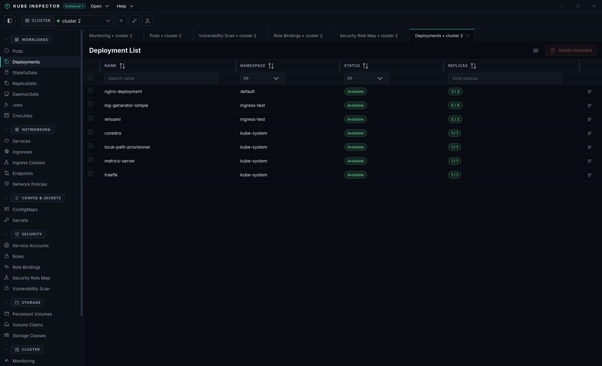

# Deployments

The Deployments screen lists all Deployment resources across all namespaces.

{ .doc-shot }

## Columns

| Column | Description |
|---|---|
| Name | Deployment name |
| Namespace | Namespace |
| Replicas | Desired / ready replica count |
| Image | Container image(s) |
| Age | Time since creation |

## Actions

Every per-row action lives in the **⋮** menu at the end of the row: Describe,
Port forward, Scale and Rollout restart.

### Scale

**⋮ → Scale.** Set the replica count with the slider or by typing an exact
number, then confirm. Kube Inspector patches the Deployment's `spec.replicas`
immediately — nothing else in the manifest is touched, so this does not trigger
a rollout.

The dialog warns you in two situations, and lets you proceed in both:

- **A HorizontalPodAutoscaler targets this Deployment.** It names the HPA and
  its min/max. Your change takes effect at once, and the autoscaler will move
  the count back on its next reconcile — scaling by hand under an HPA is
  temporary by definition.
- **You asked for 0 replicas.** That stops the workload; it does not delete it.

### Rollout restart

**⋮ → Rollout restart.** Confirms, then restarts every pod in the Deployment by
rolling them one generation forward — exactly what `kubectl rollout restart`
does, using the same `kubectl.kubernetes.io/restartedAt` annotation.

Use it when the image tag has not changed but the pods need to come back: a
rotated Secret, a re-read ConfigMap, a stuck sidecar. The Deployment's own
update strategy governs how disruptive that is, so a `RollingUpdate` deployment
with more than one replica stays available throughout.

### Describe

**⋮ → Describe.** Opens `kubectl describe` output — conditions, the current
ReplicaSet and the object's recent events — in a panel beside the list. See
[Describe](../workspace/describe.md).

### Port forward

**⋮ → Port forward.** Opens a tunnel from `127.0.0.1` to a port on one of this
Deployment's pods, re-resolving and reconnecting if that pod is replaced. See
[Port forwarding](../workspace/port-forwarding.md).

### View / Edit YAML

Double-click a row to open the YAML editor panel. The full deployment manifest loads in Monaco editor. Make your changes and click **Apply** to push them to the cluster.

!!! warning
    Editing YAML applies whatever your change implies: touching the pod template (an image, an env var) triggers a rolling update, touching an annotation does not. For a replica-count change alone use **Scale**, and for a restart with no spec change use **Rollout restart**.

### View Logs

Click **Logs** to open a log panel that aggregates logs from all pods managed by this deployment. Use the pod selector dropdown inside the log panel to switch between individual pods.

### Delete

Select one or more deployments and click **Delete Selected**. This deletes the Deployment object; managed ReplicaSets and Pods are garbage collected by Kubernetes.
